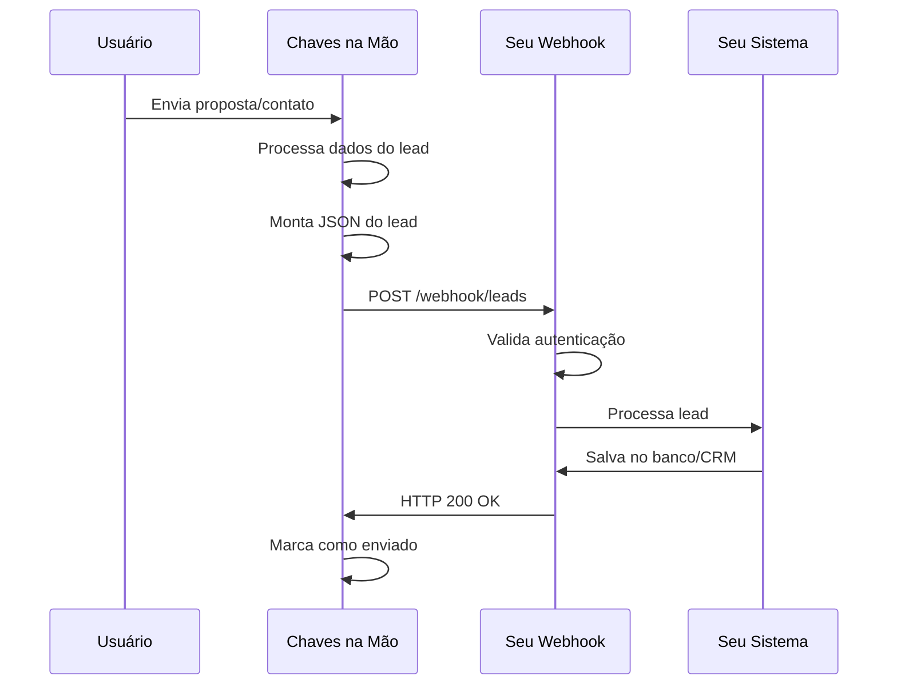

# Fluxo de Integração

Entenda como funciona o fluxo completo desde a geração do lead até o recebimento em seu sistema.

## Visão Geral



## Etapas Detalhadas

### 1. Geração do Lead

O lead é gerado quando um usuário interessado:

- Preenche um formulário de proposta

### 2. Processamento Interno

A Chaves na Mão:

1. **Coleta os dados** do formulário/proposta
2. **Busca informações complementares**:
   - Dados do anúncio (veículo ou imóvel)
   - Dados do cliente/anunciante
   - Tipo de proposta
3. **Identifica o segmento** (VEHICLE ou REALTY)
4. **Monta o JSON** conforme o formato adequado

### 3. Preparação da Requisição

O sistema prepara a requisição HTTP:

```javascript
// Estrutura da requisição
{
  method: 'POST',
  url: 'https://seu-webhook-url.com/leads',
  headers: {
    'Content-Type': 'application/json',
    'User-Agent': 'chavesnamao-leads-api',
    'Authorization': 'Basic ' + base64(email + ':' + token)
  },
  body: JSON.stringify(leadData)
}
```

### 4. Envio do Webhook

A requisição é enviada para a URL configurada:

- **Timeout**: 30 segundos
- **Retry**: Até 3 tentativas em caso de falha
- **Intervalo entre retries**: Exponencial (1s, 5s, 15s)

## Cenários de Resposta

### ✅ Sucesso (200-299)

```http
HTTP/1.1 200 OK
Content-Type: application/json

{
  "success": true,
  "leadId": "123",
  "message": "Lead recebido com sucesso"
}
```

O lead é marcado como enviado e não será reenviado.

### ❌ Erro no Cliente (400-499)

```http
HTTP/1.1 400 Bad Request
Content-Type: application/json

{
  "error": "Dados inválidos",
  "details": "Campo 'email' é obrigatório"
}
```

O lead é marcado como erro e **não** será reenviado automaticamente.

### ⚠️ Erro no Servidor (500-599)

```http
HTTP/1.1 500 Internal Server Error
Content-Type: application/json

{
  "error": "Erro interno ao processar lead"
}
```

O sistema tentará reenviar o lead (até 3 tentativas).

### ⏱️ Timeout

Se o endpoint não responder em 30 segundos:
- A conexão é encerrada
- O envio é considerado falha
- Retry automático é agendado

## Próximos Passos

- [Detalhes de Autenticação](/api/autenticacao)
- [Estrutura de Dados - Veículos](/api/veiculos)
- [Estrutura de Dados - Imóveis](/api/imoveis)
